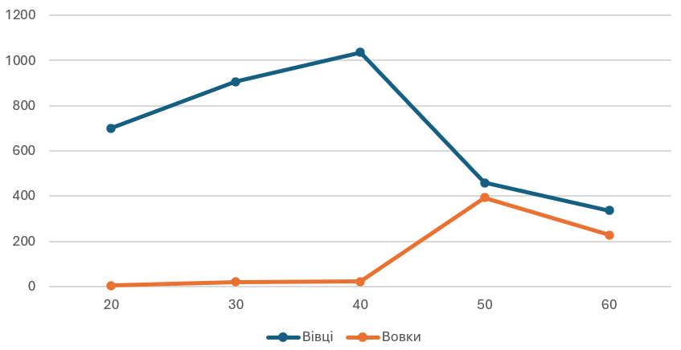
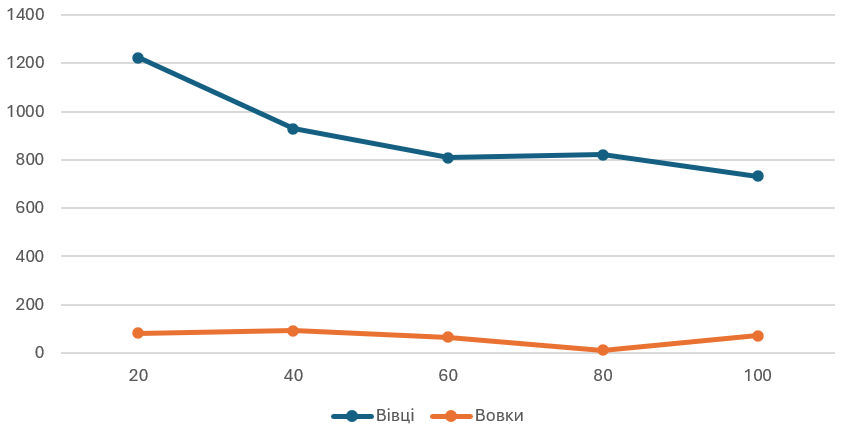
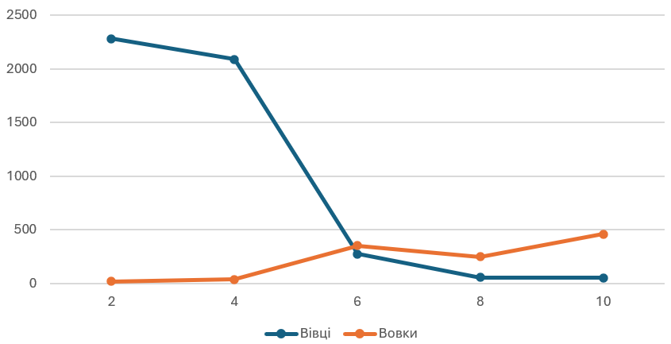

# Комп'ютерні системи імітаційного моделювання
# СПм-24-1, Івасенко І.М.
## Лабораторна робота №1. Опис імітаційних моделей та проведення обчислювальних експериментів
## Варіант №7

### Опис моделі 
Дана модель досліджує стабільність екосистем «хижак-жертва». Така система називається нестабільною, якщо вона має тенденцію призвести до вимирання одного або кількох видів. Навпаки, система є стабільною, якщо вона має тенденцію підтримувати себе з часом, незважаючи на коливання чисельності популяцій.

### Параметри:
1. grass-regrowth-time - час, необхідний для відновлення трави;
2. initial-number-sheep - початкова кількість овець;
3. initial-number-wolves - початкова кількість вовків;
4. sheep-gain-from-food - кількість енергії, яку отримує вівця від трави;
5. wolf-gain-from-food - кількість енергії, яку отримує вовк від вівці;
6. sheep-reproduce - імовірність розмноження овець на кожному такті;
7. wolf-reproduce - імовірність розмноження вовків на кожному такті.

### Показники роботи моделі:
1. Мінімальна та максимальна кількість овець за час симуляції;
2. Мінімальна та максимальна кількість вовків за час симуляції;
3. Пік популяції вовків - максимальна кількість хижаків, досягнута після періоду зростання популяції овець;
4. Середня кількість трави на полі як показник потенціалу популяції овець до збільшення;
5. Кількість вимирань - кількість моментів коли популяція овець або вовків падає до нуля;
6. Стабільність екосистеми - період часу, протягом якого обидва види співіснують;
7. Фаза циклу "хижак-жертва" - момент, коли кількість вовків перевищує кількість овець, що свідчить про перехід до наступної фази циклу.

### Алгоритм зміни станів моделі:
1. "вівці-вовки" - вовки та вівці випадково блукають ландшафтом, поки вовки шукають овець для полювання. Кожен крок коштує вовкам енергії, і вони повинні їсти овець, щоб поповнити свою енергію, призакінченні енергії вовки гинуть. Щоб популяція могла продовжуватися, кожен вовк або вівця має фіксовану ймовірність розмноження на кожному кроці часу. У цьому варіанті ми моделюємо траву як «нескінченну», щоб вівці завжди мали достатньо енергії, і ми не моделюємо явно поїдання або зростання трави. Таким чином, вівці не отримують і не втрачають енергію, їдячи або рухаючись.

2. "вівці-вовки-трава" - додає до моделі траву. Поведінка вовків є ідентичною до першого варіанту, однак тепер вівці також потребують енергію. Коли в них закінчується енергія, вони так само гинуть. ТРава відростає через фіксований період часу. Це варіант більше відповідає класичним моделям популяційних коливань.

### Недоліки моделі:
Єдиним помітним недоліком такого моделювання є спрощеність в порівнянні з реальністю, де присутні безліч інших факторів (епідемії, погода, втручаня людини, наявність інших видів в екосистемі). Модель є гарною для розуміння трендів та візуалізації взаємозалежності двох видів, але не відображає в повній мірі складність їх взаємодії в реальному світі.

### Експерименти
#### 1. Вплив початкової кількості овець на обидві популяції 
Досліджується вплив кількості овець на розвиток подій та домінування однієї з популяцій. Тривалість ексеприменту 100 тактів.
<table>
<thead>
<tr><th>Кількість овець</th><th>Максимальна кількість овець</th><th>Максимальна кількість вовків</th></tr>
</thead>
<tbody>
<tr><td>20</td><td>700</td><td>5</td></tr>
<tr><td>30</td><td>907</td><td>20</td></tr>
<tr><td>40</td><td>1037</td><td>23</td></tr>
<tr><td>50</td><td>459</td><td>394</td></tr>
<tr><td>60</td><td>336</td><td>229</td></tr>
</tbody>
</table>

Початкова кількість овець впливає на стабільність системи нелінійно. При низьких кількостях овець вовки не можуть розмножуватися швидко, а при збільшенні кількості овець система стає нестійкою: різкий ріст вовків призводить до коливань та падіння чисельності овець і їх подальшому вимиранні. 

#### 2. Вплив початкової кількості вовків на обидві популяції 
Досліджується вплив кількості вовків на розвиток подій та домінування однієї з популяцій. Тривалість ексеприменту 100 тактів.
<table>
<thead>
<tr><th>Кількість вовків</th><th>Максимальна кількість овець</th><th>Максимальна кількість вовків</th></tr>
</thead>
<tbody>
<tr><td>20</td><td>1223</td><td>82</td></tr>
<tr><td>40</td><td>930</td><td>93</td></tr>
<tr><td>60</td><td>809</td><td>65</td></tr>
<tr><td>80</td><td>821</td><td>12</td></tr>
<tr><td>100</td><td>732</td><td>71</td></tr>
</tbody>
</table>

При малій кількості вовків популяція овець стрімко зростає. Коли стартова кількість тварин обох популяцій однакова, кількість вовків в кінці експерименту різко падає, що пов'язано з нестачею їжі для всієї популяції, хоча попри це з часом кількість починає вирівнюватись

#### 3. Вплив коефіцієнту розмноження вовків на популяції
Досліджується вплив коефіцієнту розмнження вовків на розвиток обох популяцій. Тривалість ексеприменту 100 тактів.
<table>
<thead>
<tr><th>Коефіцієнт</th><th>Максимальна кількість овець</th><th>Максимальна кількість вовків</th></tr>
</thead>
<tbody>
<tr><td>2%</td><td>2281</td><td>20</td></tr>
<tr><td>4%</td><td>2087</td><td>39</td></tr>
<tr><td>6%</td><td>276</td><td>355</td></tr>
<tr><td>8%</td><td>58</td><td>249</td></tr>
<tr><td>10%</td><td>52</td><td>462</td></tr>
</tbody>
</table>

При малому та стандартному (4%) значенні коефіцієнту кількість вовків зростає дуже повільно, в той час як овець - вшидко. Али при збільшенні коефіцієнту до 10%, вовки починають стрімко розмножуватись та скорочувати популяцію овець.

