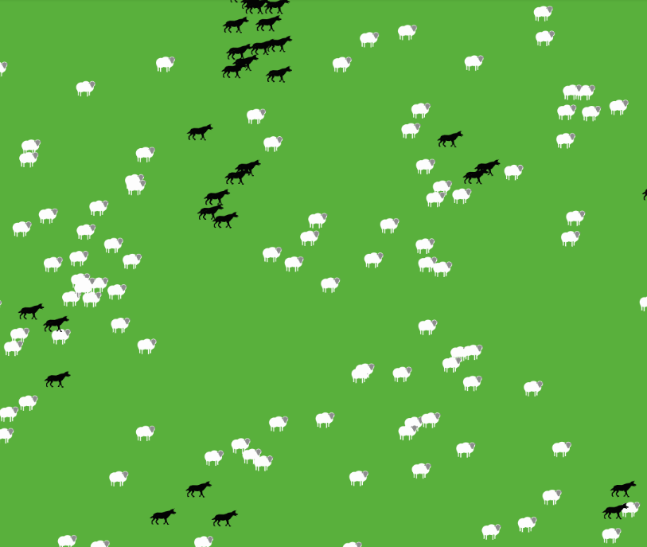
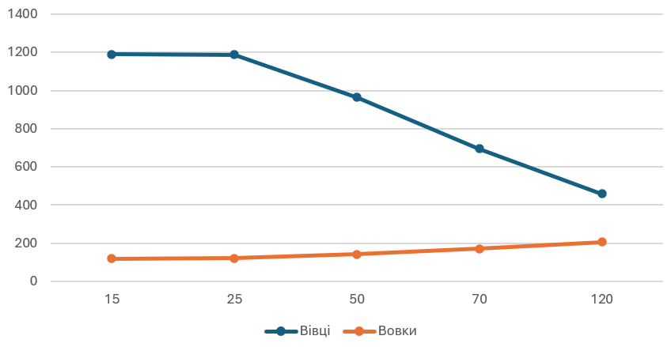

# Комп'ютерні системи імітаційного моделювання
# СПм-24-1, Івасенко І.М.
## Лабораторна робота №2. Редагування імітаційних моделей у середовищі NetLogo
## Варіант №7

Лабораторна робота полягає у корекції внутрішньої логіки зміни стану тієї самої моделі, з якою вже ознайомилися під час виконання попередньої лабораторної, що була присвячена опису імітаційних моделей. Тепер же необхідно змінити цей код. Згідно завдання необхідно прибрати "зграйність" вовків - тепер перед початком свого ходу вовки повинні "оглядатися", перевіряючи оточення, та обирати напрямок руху виходячи з наявності вівець та відсутності інших вовків. Якщо немає іншої можливості – переміщається випадково. При знаходженні на одній ділянці поля двох вовків залишається лише один з них. Вівці переміщаються випадковим чином, але при виявленні вовка на одній із клітин поруч змінюють напрямок на протилежний.

### Внесені зміни у вихідну логіку моделі, за варіантом:
Оновлено процедури ask sheep/wolf, до низ додано виклик нових процедур, що описують рух тварин.

<pre>
 ask sheep [
    move-sheep
    if model-version = "sheep-wolves-grass" [
      set energy energy - 0.1
      eat-grass
      death
    ]
    reproduce-sheep
  ]

  ask wolves [
    move-wolf
    set energy energy - 0.1
    eat-sheep
    death
    reproduce-wolves
  ]
</pre>

Для корегування поведінки популяцій, було створено дві нових процедури. Якщо поряд з вовком є вівця, він повертається до неї та починає переслідувати. Якщо вовк зустрічає інших вовків, він розвертається в протилежний бік, щоб уникати їх.

<pre>
  to move-wolf
  let nearby-sheep one-of sheep in-radius 15
  let nearby-wolf one-of other wolves in-radius 1

  ifelse nearby-sheep != nobody [
    face nearby-sheep
  ][
    ifelse nearby-wolf != nobody [
      rt random 180
      lt random 90
    ][
      rt random 50
      lt random 50
    ]
  ]

  fd 1
end

to move-sheep
  let nearby-wolf one-of wolves in-radius 2
  ifelse nearby-wolf != nobody [
    face nearby-wolf
    rt 180
    fd 1
  ][
    rt random 50
    lt random 50
    fd 1
  ]
end
</pre>

Для видалення одного з вовків у випадку їх зіткнення було також створено новий метод:

<pre>
  to remove-duplicate-wolves
  ask patches [
    let wolvesHere wolves-here
    if count wolvesHere > 1 [
      ; залишаємо лише одного вовка — вбиваємо зайвих
      ask n-of (count wolvesHere - 1) wolvesHere [ die ]
    ]
  ]
end
</pre>

### Внесені зміни у вихідну логіку моделі, на власний розсуд
В якості власного нововведення було додано процедуру для реалізації збиття вовків у зграї. Процедура пеервіряє оточення на наявність інших вовків, обраховує середній напярмок руху вовків, з урахуванням якого корегує рух тварини.

<pre>
to move-wolf-pack
  let packmates other wolves in-radius 4
  if any? packmates [
    let avg-dir mean [ heading ] of packmates
    set heading (heading + avg-dir) / 2   ; вирівнювання напрямку
  ]
  rt random 20
  lt random 20
  fd 1
end
</pre>

Нижче наведено приклад формування зграй вовків

Фінальний код моделі та її інтерфейс доступні за [посиланням]([example-model.nlogo](https://www.netlogoweb.org/launch#https://www.netlogoweb.org/assets/modelslib/Sample%20Models/Biology/Wolf%20Sheep%20Predation.nlogox)). 

## Обчислювальні експерименти
Для дослідження впливу "зграй" вовків на модель було проведено експеримент з 1 лр, з впливу початкової кількості вовків на розмір обох популяцій по завершенню дослідження.

<table>
<thead>
<tr><th>Кількість вовків</th><th>Максимальна кількість овець</th><th>Максимальна кількість вовків</th></tr>
</thead>
<tbody>
<tr><td>15</td><td>1191</td><td>120</td></tr>
<tr><td>25</td><td>1189</td><td>112</td></tr>
<tr><td>50</td><td>965</td><td>141</td></tr>
<tr><td>70</td><td>695</td><td>172</td></tr>
<tr><td>120</td><td>460</td><td>207</td></tr>
</tbody>
</table>

Як бачимо, оновлена поведінка тварин сильно впливає на розвиток обох популяцій. Вовки завдяки командній роботі більш ефективно полюють на овець, і вони не встигають розмножуватись надто швидко. В той самий час, вівці пересуваються на просто рандомно, а уникають вовків, що дозволяє частині з них виживати. Таким чином можна зробити висновок, що оновлена модель є більш реалістичною, в наслідок чого обом популяціям легше регулювати кількість одне одного. 

