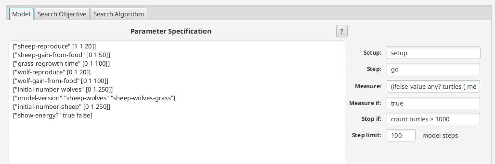
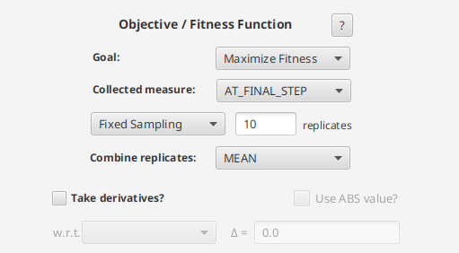
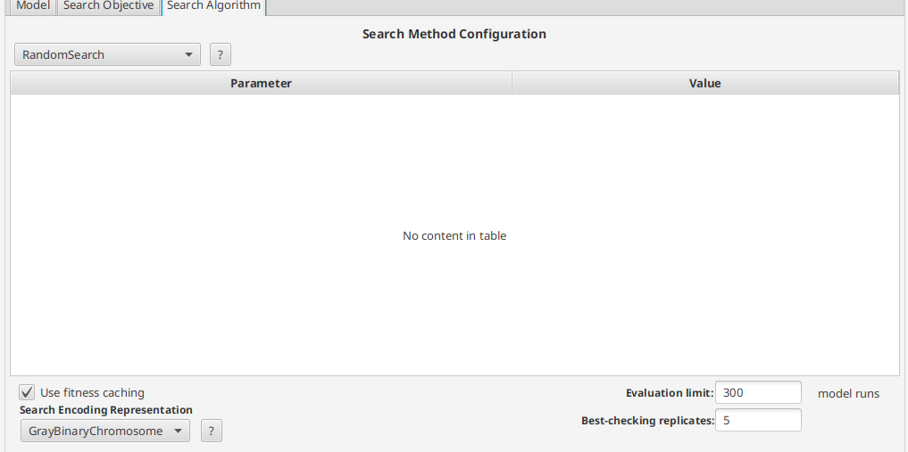
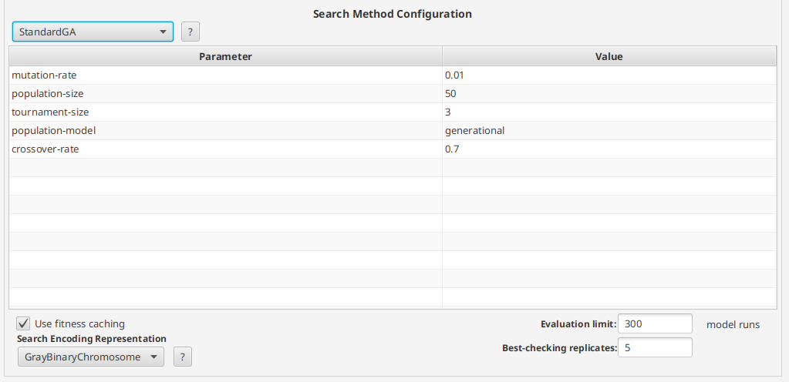
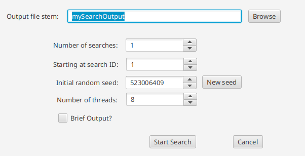
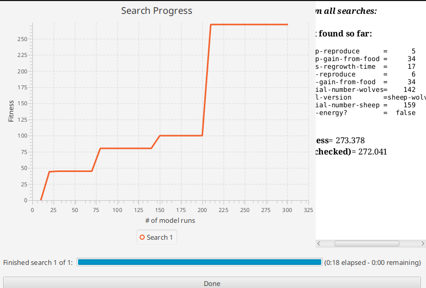
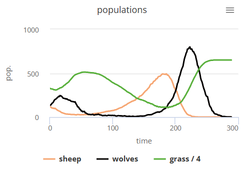
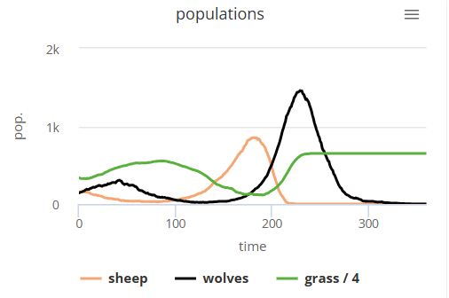

# Комп'ютерні системи імітаційного моделювання
# СПм-24-1, Івасенко І.М.
## Лабораторна робота №3. Використання засобів обчислювального интелекту для оптимізації імітаційних моделей
## Варіант №7

Дослідити застосування генетичних алгоритмів та випадкового пошуку для налаштування параметрів імітаційних моделей, використовуючи середовище BehaviorSearch.

### Опис моделі 
Дана модель досліджує стабільність екосистем «хижак-жертва». Така система називається нестабільною, якщо вона має тенденцію призвести до вимирання одного або кількох видів. Навпаки, система є стабільною, якщо вона має тенденцію підтримувати себе з часом, незважаючи на коливання чисельності популяцій.

### Параметри:
1. grass-regrowth-time - час, необхідний для відновлення трави;
2. initial-number-sheep - початкова кількість овець;
3. initial-number-wolves - початкова кількість вовків;
4. sheep-gain-from-food - кількість енергії, яку отримує вівця від трави;
5. wolf-gain-from-food - кількість енергії, яку отримує вовк від вівці;
6. sheep-reproduce - імовірність розмноження овець на кожному такті;
7. wolf-reproduce - імовірність розмноження вовків на кожному такті.

### Показники роботи моделі:
1. Мінімальна та максимальна кількість овець за час симуляції;
2. Мінімальна та максимальна кількість вовків за час симуляції;
3. Пік популяції вовків - максимальна кількість хижаків, досягнута після періоду зростання популяції овець;
4. Середня кількість трави на полі як показник потенціалу популяції овець до збільшення;
5. Кількість вимирань - кількість моментів коли популяція овець або вовків падає до нуля;
6. Стабільність екосистеми - період часу, протягом якого обидва види співіснують;
7. Фаза циклу "хижак-жертва" - момент, коли кількість вовків перевищує кількість овець, що свідчить про перехід до наступної фази циклу.

**Параметри моделі (вкладка Model):**
Параметри та їх можливі діапазони були автоматично вилучені середовищем BehaviorSearch із вибраної імітаційної моделі, для цього є кнопка «Завантажити діапазони параметрів із інтерфейсу моделі»:

```
["sheep-reproduce" [1 1 20]]
["sheep-gain-from-food" [0 1 50]]
["grass-regrowth-time" [0 1 100]]
["wolf-reproduce" [0 1 20]]
["wolf-gain-from-food" [0 1 100]]
["initial-number-wolves" [0 1 250]]
["model-version" "sheep-wolves" "sheep-wolves-grass"]
["initial-number-sheep" [0 1 250]]
["show-energy?" true false]
```

**Використовувана міра:**

Для функції пристосованості (фітнес-функції), яка визначає ефективність кожної комбінації параметрів, було обрано середнє значення енергії агентів після завершення симуляції. Цей показник обчислюється за допомогою виразу: (ifelse-value any? turtles [ mean [energy] of turtles ] [ 0 ])
Значення дозволяє оцінити, наскільки стабільною є популяція вівців і вовків та як налаштування параметрів впливають на виживання агентів і динаміку їхнього енергетичного балансу. Чим вищим є середній рівень енергії, тим більше модель схильна підтримувати сталу та життєздатну популяцію.
Параметр Measure визначає, яке числове значення модель повертає після завершення симуляції. Вибраний показник — середня енергія всіх живих агентів на фінальному кроці — відображає підсумковий стан моделі та дає змогу кількісно виміряти вплив параметрів на довгострокову стабільність популяції.
Параметр Measure if встановлено як true, що означає безумовне обчислення цільової міри після кожного запуску моделі. Такий підхід гарантує, що фітнес визначається послідовно для кожної комбінації параметрів, незалежно від проміжної динаміки еволюції популяцій вовків чи вівців.
Параметр Stop if у цій конфігурації не використовується для дострокового завершення моделювання, оскільки поведінка моделі значною мірою залежить від циклічності хижацько-жертових процесів. Симуляції виконуються до вказаного обмеження кроків, що забезпечує можливість спостерігати стабілізацію, колапс або коливальні режими популяцій.
Параметр Step limit задає максимальну кількість тактів моделювання. Значення 100 (або інше, за потребою) гарантує достатню тривалість симуляції, щоб оцінити життєздатність популяції та сформувати репрезентативне фінальне значення енергетичного стану системи.

**Загальний вигляд вкладки налаштувань параметрів моделі:**



**Налаштування цільової функції (вкладка Search Objective):**

Параметр Goal визначає напрямок оптимізації. У даній роботі обрано режим Maximize Fitness, що дозволяє знайти такі комбінації параметрів, за яких середня енергія агентів є максимальною. Оскільки висока енергія свідчить про сталість популяції, цей режим сприяє виявленню параметрів, які забезпечують збалансовану взаємодію вовків, вівців і трави.
Параметр Collected measure встановлений у режим AT_FINAL_STEP, що означає використання показника, отриманого саме на останньому кроці моделювання. Це дозволяє порівнювати різні параметри за однакових умов, забезпечуючи коректність оцінки ефективності кожного набору.
Параметр вибірки задано як Fixed Sampling із кількома повторними запускми моделі (наприклад, 5). Множинні повтори зменшують вплив стохастичності моделі та забезпечують більш стабільні оцінки фітнес-функції.
Параметр Combine replicates встановлено на MEAN, що означає середнє арифметичне результатів усіх повторних запусків. Такий підхід згладжує випадкові коливання популяцій і дозволяє отримати більш об'єктивну оцінку ефективності параметрів.

**Загальний вигляд вкладки налаштувань цільової функції:**



**Налаштування алгоритму пошуку (вкладка Search Algorithm):**

Для оптимізації було обрано метод випадкового пошуку, що забезпечує рівномірне охоплення простору параметрів і не потребує градієнтної інформації, якої модель хижацько-жертової взаємодії не надає.
Тип хромосоми — MixedTypeChromosome, оскільки модель Wolf-Sheep Predation містить параметри як цілочисельного (наприклад, initial-number-sheep), так і булевого, та навіть рядкоого типів (наприклад, model-version). Це забезпечує коректне внутрішнє представлення параметрів без спрощень або примусового перетворення.
Параметр Evaluation limit визначає максимальну кількість запусків моделі. Значення на рівні 300 (чи інше необхідне) дозволяє достатньо дослідити простір параметрів, не створюючи надмірного навантаження на систему. Опція Best-checking replicates встановлена як 5, що дозволяє повторно уточнити якість найкращого знайденого рішення та зменшити вплив випадкових коливань у поведінці популяцій. Параметр Use fitness caching залишено включеним, що забезпечує уникнення повторних обчислень для однакових наборів параметрів і значно прискорює процес оптимізації.

**Загальний вид вкладки налаштувань алгоритму RandomSearch:**



**Загальний вид вкладки налаштувань алгоритму Standard GA:**



## **Результати використання BehaviorSearch:**

Діалогове вікно запуску пошуку:



Результат пошуку параметрів імітаційної моделі, використовуючи випадковий пошук:


Результат пошуку параметрів імітаційної моделі, використовуючи генетичний алгоритм:



Під час випадкового пошуку алгоритм просто перебирає набір параметрів у довільному порядку, без використання інформації про попередні спроби. Це видно на графіку: приріст значення fitness відбувається нерівномірно, а довгі ділянки прямої лінії свідчать, що нові випадкові конфігурації не покращують результат. У підсумку RandomMIN знаходить розв’язок середнього рівня: він є далеким від оптимального, оскільки метод не пристосовується до структури проблеми, а лише сподівається випадково натрапити на хороше поєднання параметрів.
На відміну від цього, генетичний алгоритм демонструє систематичне зростання якості рішень. Його графік fitness має помітні «сходинки», де кожне нове покращення базується на попередніх рішеннях. StandardGA комбінує кращі параметри, поступово відкидаючи гірші, і завдяки цьому швидше та впевненіше наближається до глобального максимуму. Фінальний fitness другого методу не тільки вищий, але й досягається швидше — що вказує на ефективну адаптацію алгоритму і його здатність знаходити більш збалансоване налаштування моделі.
Таким чином, RandomMIN виконує роль базового, некерованого перебору, який може бути корисним лише як початковий орієнтир, тоді як StandardGA є значно потужнішим інструментом оптимізації. Він використовує інформацію про попередні кроки для еволюційного вдосконалення параметрів, що дозволяє отримати значно якісніші результати. У підсумку генетичний пошук виявився набагато ефективнішим та забезпечив значно кращі значення fitness порівняно з випадковим пошуком.

## Перевірка коректності роботи імітаційної моделі при знайдених у BehaviorSearch значеннях параметрів:

Для перевірки коректності роботи імітаційної моделі були вручну підставлені оптимальні значення параметрів, знайдені методом випадкового пошуку у BehaviorSearch. Значення: sheep-reproduce = 3, ship-gain-from-food = 16, grass-regrowth = 24, wolf-reproduce = 8, wolf-gain-from-food = 33, initial-number-wolves = 135, initial-number-sheeps = 116 

Результат перевірки коректності результатів Random Search:



Для перевірки коректності роботи імітаційної моделі було вручну підставлено параметри, знайдені за допомогою генетичного алгоритму у BehaviorSearch. Значення: sheep-reproduce = 5, ship-gain-from-food = 34, grass-regrowth = 17, wolf-reproduce = 6, wolf-gain-from-food = 34, initial-number-wolves = 142, initial-number-sheeps = 159 

Результат перевірки коректності результатів Standard GA:



